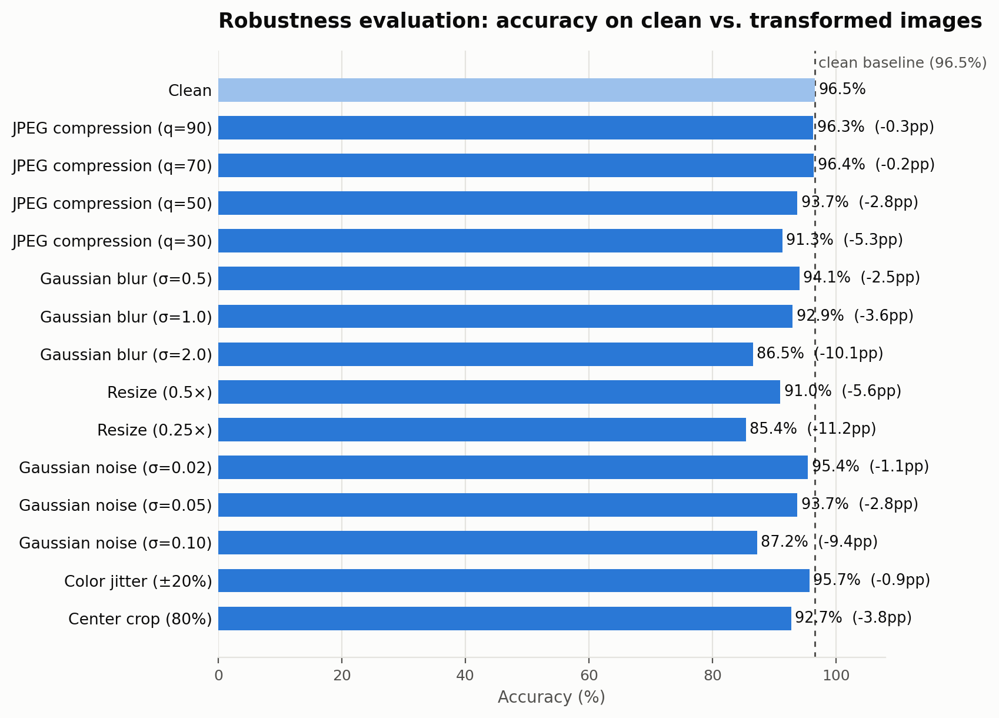

# Robustness Evaluation Summary

Generated by `python -m src.eval_robustness --data_dir data/test --checkpoint results/head_best.pt`, which sweeps every transform × severity combination in the hackathon's Section 5.2 spec and writes `docs/robustness_summary.csv` (raw data below is copied from that file, not re-derived).

**Clean accuracy: 96.5%.** All six required transform families (JPEG compression, Gaussian blur, resize, Gaussian noise, color jitter, center crop) were evaluated at every severity level the spec lists.

| Transform | Severity | Accuracy | Δ vs. clean |
|---|---|---|---|
| Clean | – | 96.5% | – |
| JPEG compression | q=90 | 96.3% | −0.3pp |
| JPEG compression | q=70 | 96.4% | −0.2pp |
| JPEG compression | q=50 | 93.7% | −2.8pp |
| JPEG compression | q=30 | 91.3% | −5.3pp |
| Gaussian blur | σ=0.5 | 94.1% | −2.5pp |
| Gaussian blur | σ=1.0 | 92.9% | −3.6pp |
| Gaussian blur | σ=2.0 | 86.5% | −10.1pp |
| Resize | 0.5× | 91.0% | −5.6pp |
| Resize | 0.25× | 85.4% | −11.2pp |
| Gaussian noise | σ=0.02 | 95.4% | −1.1pp |
| Gaussian noise | σ=0.05 | 93.7% | −2.8pp |
| Gaussian noise | σ=0.10 | 87.2% | −9.4pp |
| Color jitter | ±20% | 95.7% | −0.9pp |
| Center crop | 80% | 92.7% | −3.8pp |

## Reading it

**Most robust to:** light JPEG re-compression (q=90/70, within 0.3pp of clean) and color jitter (±20%, −0.9pp). These transforms preserve most of the fine-grained detail the CLIP-feature + forensic-feature pipeline relies on.

**Most damaging:** aggressive downscaling (0.25× resize, −11.2pp), heavy blur (σ=2.0, −10.1pp), and heavy sensor noise (σ=0.10, −9.4pp). All three destroy fine texture and high-frequency detail before anything else, which is exactly what the model leans on most.

**Middle ground:** moderate JPEG compression, moderate blur/noise, and center-crop degrade gracefully — a few points per severity step — rather than collapsing, which suggests the training-time random robustness augmentation (the same transform families applied on the fly during training, see `src/augmentations.py` and the README) is doing real work, even though it doesn't fully close the gap at the harshest settings.

*Note: an earlier draft of the README's Limitations section quoted slightly different Δ figures (e.g. −12.1pp / −9.2pp / −8.7pp for the same three worst conditions) from a prior model version, before the `branch-lightSources` merge added the handcrafted forensic features. The numbers above are freshly re-derived from the current `docs/robustness_summary.csv` and are what should be quoted going forward — the README should be updated to match (see README polish notes).*
